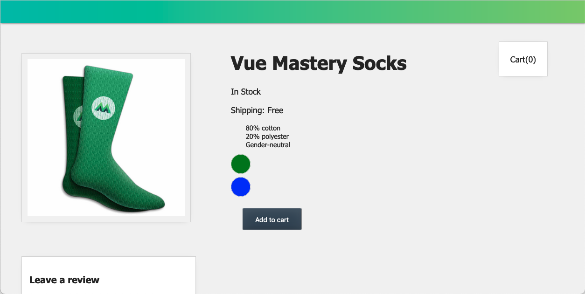
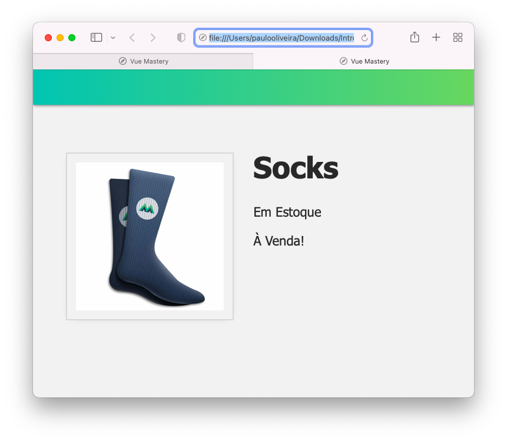

# **Tutorial Introdução ao Vue.JS 3**
Este diretório é referente a um tutorial utilizado para o aprendzado dos fundamentos do Vue.JS e construir uma aplicação (_app_) para colocar estes conceitos em prática, como na figura abaixo.

No final de cada tutorial, há um "Coding Challenge" para colocar os conceitos em prática. Os códigos no diretório de tutoriais contém o código alterado conforme o tutorial abaixo, juntamente com o que foi solicitado no "Coding Challenge"

### **IDE e Extensões Recomendadas**

A IDE recomendada é o VS Code, [baixe-o](https://code.visualstudio.com/download), e depois instale-o.  Ele oferece suporte a extensões para realizar esse projeto. Uma extensão recomendada pelo tutorial é a [es6-string.html](https://marketplace.visualstudio.com/items?itemName=Tobermory.es6-string-html). 

### **Renderização Condicional**
Rendereização Condicional é uma ferramenta usada para mostrar diferentes elementos HTML por uma condição. Esse tutorial vai exibir um elemento que diz "em estoque" quando nosso produto está em estoque ou outro elemento que diz "fora de estoque" quando não está.

O resultado deste tutorial será:

---

# **Introdution Tutorial Vue.JS 3**
This directory refers to a tutorial used to learn the basics of Vue.JS and build an application (_app_) to put these concepts into practice, as in the picture below.

At the end of each tutorial, there is a "Coding Challenge" to put the concepts into practice. The codes in the tutorial directory contain the code changed according to the tutorial below, along with what was requested in the "Coding Challenge"

### **Recommended  IDE and extensions**

The recommended IDE is VS Code, [download it](https://code.visualstudio.com/download), and then install it.  It supports extensions for this project. One extension recommended by the tutorial is [es6-string.html](https://marketplace.visualstudio.com/items?itemName=Tobermory.es6-string-html). 

### **Conditional Render**
Conditionl Render is a tool used for show differents HTML elements by some condition. This tutorial will show an element that says "Em Estoque"(in stock) when our product is in stock, and other element that says "fora de estoque" (out of sotck) when it is not.

The result of this tutorial will be:

